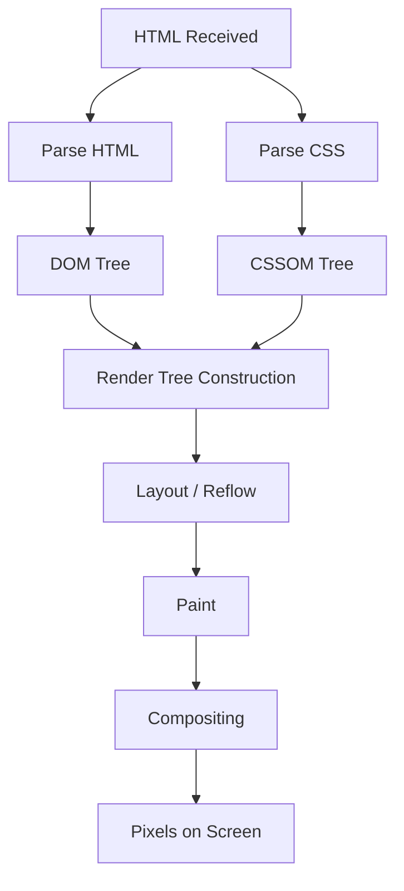
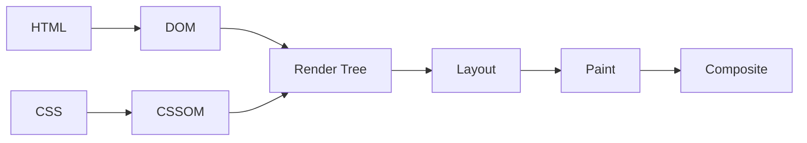
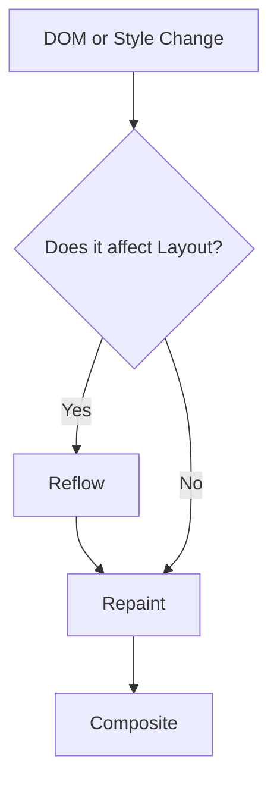

# 🧠 How the Browser Works – Rendering Pipeline

Understanding the browser rendering pipeline is critical for frontend performance, React optimization, and system design interviews.

---

# 📌 High-Level Overview

When you enter a URL in the browser:

1. DNS Lookup
2. TCP Handshake
3. TLS Negotiation (HTTPS)
4. HTTP Request / Response
5. Browser receives HTML
6. **Rendering Pipeline begins**

---

# 🎨 Rendering Pipeline – Visual Diagram

---

# 1️⃣ HTML → DOM

The browser parses HTML into the **DOM (Document Object Model)**.

* Tree representation of the document
* Incremental parsing
* `<script>` can block parsing

---

# 2️⃣ CSS → CSSOM

The browser parses CSS into the **CSSOM (CSS Object Model)**.

* Matches rules to DOM nodes
* Computes final styles
* CSS is render-blocking

---

# 3️⃣ DOM + CSSOM → Render Tree

Render Tree:

* Contains only visible elements
* Includes computed styles
* Excludes `display: none`

---

# 4️⃣ Layout (Reflow)

The browser calculates:

* Position
* Size
* Box model
* Flow relationships

⚠️ This step is expensive.

---

# 5️⃣ Paint

The browser fills pixels:

* Text
* Colors
* Borders
* Shadows

No layout calculation here.

---

# 6️⃣ Compositing

Modern browsers:

* Split page into layers
* Use GPU to composite layers
* Optimize animations using `transform` and `opacity`

---

# 🔥 Critical Rendering Path

---

# 🔄 Reflow vs Repaint Flow

---

# 🔥 Reflow vs Repaint

| Reflow              | Repaint                 |
| ------------------- | ----------------------- |
| Recalculates layout | Redraws pixels          |
| Expensive           | Less expensive          |
| Triggers repaint    | Does NOT trigger reflow |

Reflow is significantly more costly.

---

# ⚠️ What Triggers Reflow?

* Changing width/height
* Changing font size
* Adding/removing elements
* Resizing window
* Reading layout properties after writing styles

---

# 🚀 Performance Best Practices

* Minimize render-blocking CSS
* Use `async` / `defer`
* Reduce DOM depth
* Use `transform` for animations
* Batch DOM reads/writes
* Avoid layout thrashing

---

# ⚛️ React Connection

When state updates:

1. Virtual DOM updates
2. Diffing
3. Real DOM update
4. Browser may trigger layout + paint

Understanding rendering pipeline helps prevent unnecessary reflows.

---

# 🎯 Interview Summary

If asked:

**“How does a browser render a page?”**

> The browser parses HTML into DOM and CSS into CSSOM.
> These combine to create the render tree.
> Layout calculates element positions and sizes.
> Paint draws pixels, and compositing combines layers using the GPU.
> Reflow is expensive, so performance optimizations focus on minimizing layout recalculations.

---

End of Document.
