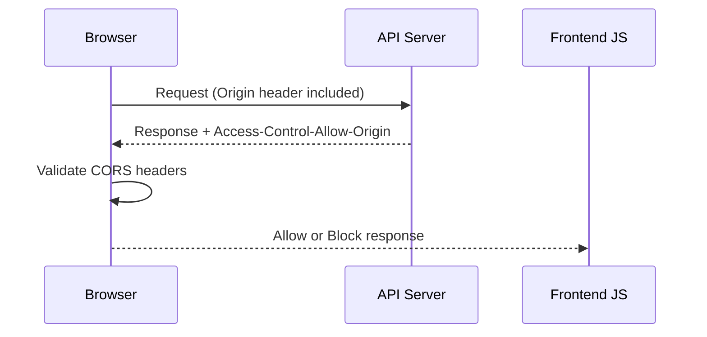
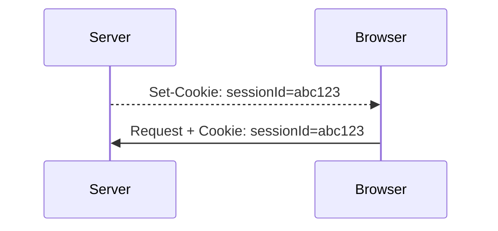

# 🌐 CORS, Cookies & Web Storage – Complete Guide

This document covers three critical browser and security concepts:

* CORS (Cross-Origin Resource Sharing)
* Cookies
* LocalStorage
* SessionStorage

These are essential for:

* Authentication design
* Frontend security
* System design interviews
* Production-grade web applications

---

> 📌 Note: Mermaid diagrams below render automatically on GitHub and modern Markdown editors.

---

# 1️⃣ CORS (Cross-Origin Resource Sharing)

---

## 🔹 What is an Origin?

An origin consists of:

```
Protocol + Domain + Port
```

Example:

```
https://example.com:443
```

If any of these differ → it is a different origin.

---

## 🔹 Same-Origin Policy (SOP)

Browsers enforce:

> JavaScript can only read responses from the same origin by default.

This prevents malicious websites from accessing sensitive user data.

Important:

* You can SEND cross-origin requests.
* You cannot READ the response unless the server allows it.

---

## 🔹 What is CORS?

CORS is a browser security mechanism that allows servers to specify:

> Which origins are allowed to access their resources.

---

## 🔹 CORS Flow



Server always responds.
Browser decides whether JS can access the response.

---

## 🔹 Simple vs Preflight Request

### ✅ Simple Request

* GET / POST / HEAD
* Limited headers
* No preflight

---

### 🚀 Preflight Request (OPTIONS)

Triggered when:

* PUT / DELETE / PATCH
* Custom headers
* `application/json`

Browser first sends:

```
OPTIONS /resource
```

Server must respond with:

```
Access-Control-Allow-Origin
Access-Control-Allow-Methods
Access-Control-Allow-Headers
```

Only then actual request is sent.

---

## 🔥 Important CORS Headers

* `Access-Control-Allow-Origin`
* `Access-Control-Allow-Methods`
* `Access-Control-Allow-Headers`
* `Access-Control-Allow-Credentials`

⚠️ If using credentials:

* Cannot use `*`
* Must specify exact origin

---

## 🎯 Interview-Ready Summary (CORS)

> CORS is a browser-enforced security mechanism that relaxes the Same-Origin Policy by allowing servers to specify which origins can access their resources via HTTP headers.

---

# 2️⃣ Cookies

---

## 🔹 What Are Cookies?

Cookies are small pieces of data stored in the browser and automatically sent with HTTP requests to matching domains.

Used for:

* Authentication
* Session management
* Tracking
* Preferences

---

## 🔹 Cookie Flow



---

## 🔹 Important Cookie Attributes

| Attribute         | Purpose                                        |
| ----------------- | ---------------------------------------------- |
| HttpOnly          | Prevents JavaScript access (protects from XSS) |
| Secure            | Sent only over HTTPS                           |
| SameSite          | Controls cross-site sending                    |
| Domain            | Restricts domain                               |
| Path              | Restricts URL path                             |
| Expires / Max-Age | Expiration                                     |

---

## 🔥 SameSite Values

* `Strict` → Only same-site requests
* `Lax` → Allows top-level navigation
* `None` → Allows cross-site (requires Secure=true)

---

## 🔐 Security Tradeoffs

Cookies:

* ✅ Protected from XSS if HttpOnly
* ⚠️ Vulnerable to CSRF (unless SameSite or CSRF tokens used)

---

## 🎯 Interview-Ready Summary (Cookies)

> Cookies are small data pieces stored by the browser and automatically sent with requests. They are ideal for authentication when configured with HttpOnly, Secure, and SameSite attributes.

---

# 3️⃣ LocalStorage

---

## 🔹 What is LocalStorage?

* Key-value storage
* Persistent (even after browser restart)
* Accessible via JavaScript
* ~5MB storage limit
* NOT automatically sent with HTTP requests

---

## 🔹 Example

```javascript
localStorage.setItem("theme", "dark");
const theme = localStorage.getItem("theme");
```

---

## 🔐 Security Risk

If your app has XSS vulnerability:

Attacker can run:

```javascript
localStorage.getItem("token");
```

❌ Avoid storing sensitive JWT tokens in LocalStorage in production.

---

## 🎯 When to Use

* UI preferences
* Theme settings
* Cached non-sensitive data
* Client-only state

---

# 4️⃣ SessionStorage

---

## 🔹 What is SessionStorage?

* Same API as LocalStorage
* Cleared when tab closes
* Isolated per tab
* ~5MB limit

---

## 🎯 When to Use

* Temporary UI state
* Multi-step forms
* Short-lived data

---

# 🔍 Storage Comparison

| Feature                          | Cookies                 | LocalStorage | SessionStorage |
| -------------------------------- | ----------------------- | ------------ | -------------- |
| Sent automatically with requests | ✅ Yes                   | ❌ No         | ❌ No           |
| Accessible via JS                | ✅ Yes (unless HttpOnly) | ✅ Yes        | ✅ Yes          |
| Persistent                       | Configurable            | ✅ Yes        | ❌ No           |
| Storage Limit                    | ~4KB                    | ~5MB         | ~5MB           |
| Best for Auth                    | ✅ Yes                   | ❌ Risky      | ❌ Risky        |

---

# 🔥 Security Context: XSS vs CSRF

| Attack | Affects Cookies | Affects LocalStorage |
| ------ | --------------- | -------------------- |
| XSS    | ❌ (if HttpOnly) | 🔴 Yes               |
| CSRF   | 🔴 Yes          | ❌ No                 |

---

## 🧠 Senior-Level Insight

* LocalStorage → Vulnerable to XSS
* Cookies → Vulnerable to CSRF
* Proper auth systems combine:

  * HttpOnly cookies
  * SameSite protection
  * CSRF tokens
  * Short-lived access tokens

Security is about balancing tradeoffs.

---

# 🚀 Why This Matters

Mastering these concepts helps you:

* Design secure authentication systems
* Prevent XSS & CSRF attacks
* Pass frontend & system design interviews
* Build scalable SaaS applications

---

End of Document.
