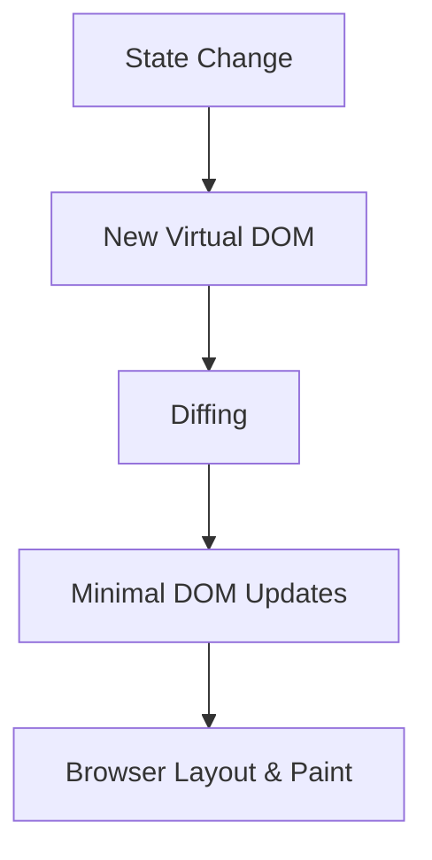
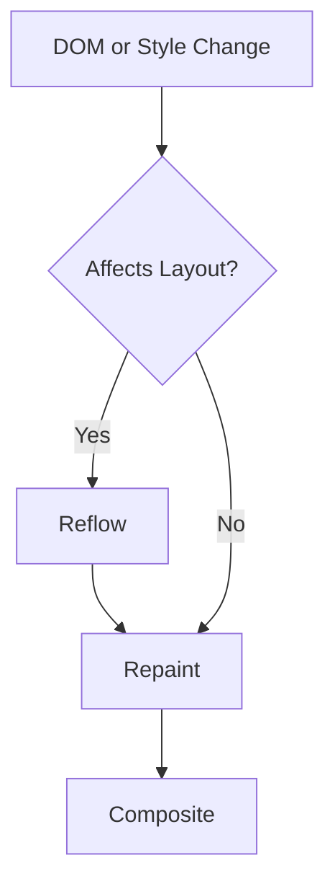
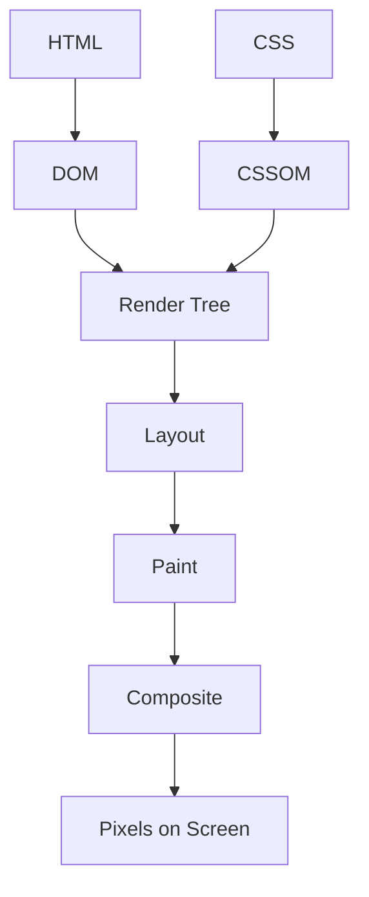

# 🧠 Frontend Performance Fundamentals

This document covers three critical frontend performance concepts:

* DOM & Virtual DOM
* Reflow & Repaint
* Critical Rendering Path

Understanding these concepts is essential for:

* React optimization
* Debugging UI lag
* System design interviews
* Building scalable frontend applications

---

# 1️⃣ DOM & Virtual DOM

---

## 🔹 What is the DOM?

The **DOM (Document Object Model)** is a tree representation of an HTML document.

### Example

```html
<div>
  <h1>Hello</h1>
  <p>World</p>
</div>
```

DOM representation:

```
div
 ├── h1
 └── p
```

The DOM is:

* Mutable
* Updated via JavaScript
* Expensive to modify

Why expensive?

Because DOM updates may trigger:

* Layout (Reflow)
* Paint
* Composite

---

## 🔹 What is Virtual DOM?

The **Virtual DOM** is an in-memory JavaScript representation of the real DOM used by frameworks like React.

### How It Works

1. State changes
2. New Virtual DOM is created
3. React compares old vs new (Diffing)
4. Minimal real DOM updates applied

This process is called **Reconciliation**.

---

## 🔹 Why Virtual DOM Helps

* DOM operations are expensive
* Virtual DOM updates happen in memory
* React batches updates
* Only minimal DOM mutations occur

⚠️ Important:

Virtual DOM does NOT make everything faster.
It reduces unnecessary DOM manipulations.

---

## 🔹 React Rendering Flow



---

# 2️⃣ Reflow & Repaint

---

## 🔹 Reflow (Layout)

Reflow occurs when the browser recalculates:

* Element positions
* Width/height
* Box model
* Flow relationships

Reflow is expensive.

### What Triggers Reflow?

* Changing width/height
* Changing font size
* Adding/removing elements
* Resizing window
* Reading layout properties after writing styles

---

## 🔹 Repaint

Repaint occurs when:

* Colors change
* Background changes
* Visibility changes

No layout recalculation occurs.

Repaint is cheaper than reflow.

---

## 🔥 Key Rule

Reflow → Always triggers repaint
Repaint → Does NOT trigger reflow

---

## 🔄 Reflow vs Repaint Flow



---

## 🔥 Example: Layout Thrashing (Bad Practice)

```javascript
element.style.width = "100px";
console.log(element.offsetHeight);
element.style.width = "200px";
```

This forces multiple layout recalculations.

### Better Approach

Batch reads and writes separately.

---

## 🔥 Animation Best Practice

Avoid animating:

* width
* height
* top
* left

Prefer animating:

* transform
* opacity

Because they often skip layout and use GPU compositing.

---

# 3️⃣ Critical Rendering Path

---

## 🔹 What is Critical Rendering Path?

The sequence of steps the browser performs to convert HTML, CSS, and JS into pixels.

Steps:

1. HTML → DOM
2. CSS → CSSOM
3. DOM + CSSOM → Render Tree
4. Layout
5. Paint
6. Composite

---

## 🔹 Rendering Pipeline Diagram



---

## 🔹 What Blocks Rendering?

* CSS files (render-blocking)
* Synchronous JavaScript
* Large DOM trees
* Blocking fonts

---

## 🔹 Optimization Strategies

* Minimize CSS
* Use async/defer for scripts
* Inline critical CSS
* Reduce DOM size
* Code splitting
* Lazy loading
* Avoid deep DOM nesting

---

# 🧪 Performance Example: 10,000 Row React Table

If scrolling feels slow, possible causes:

### 1️⃣ Too Many DOM Nodes

Rendering 10,000 rows increases layout and paint cost.

✅ Fix: Use virtualization (`react-window`, `react-virtualized`)

---

### 2️⃣ Unnecessary Re-renders

All rows re-render on scroll due to unstable props or missing memoization.

✅ Fix:

* Use `React.memo`
* Use stable keys
* Memoize callbacks

---

### 3️⃣ Layout Thrashing

Reading layout properties during scroll triggers repeated reflows.

✅ Fix:

* Avoid DOM reads during scroll
* Use fixed row height
* Use transform-based animations

---

# 🎯 Interview-Ready Summary

## DOM & Virtual DOM

> The DOM is a tree representation of the document. Direct DOM updates are expensive because they may trigger layout and paint. React uses a Virtual DOM to diff changes and apply minimal updates.

---

## Reflow & Repaint

> Reflow recalculates layout and is expensive. Repaint redraws pixels and is cheaper. Reflow always triggers repaint, but repaint does not trigger reflow.

---

## Critical Rendering Path

> The browser parses HTML and CSS into DOM and CSSOM, builds the render tree, performs layout, then paints and composites layers to display pixels.

---

# 🚀 Why This Matters

Mastering these concepts helps you:

* Optimize large React apps
* Debug performance bottlenecks
* Design scalable frontend systems
* Answer senior-level interview questions
* Build smooth UI experiences

---

End of Document.
